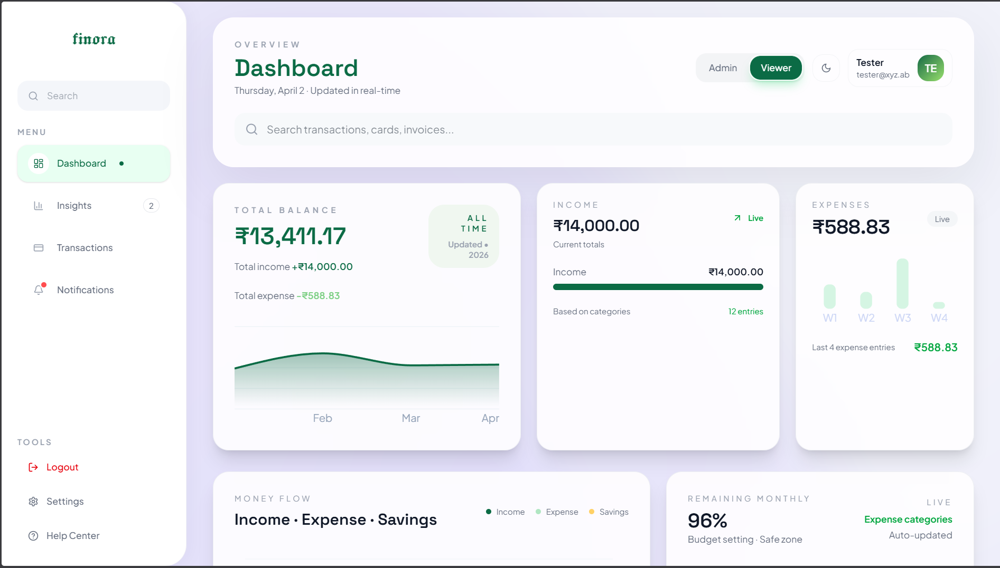
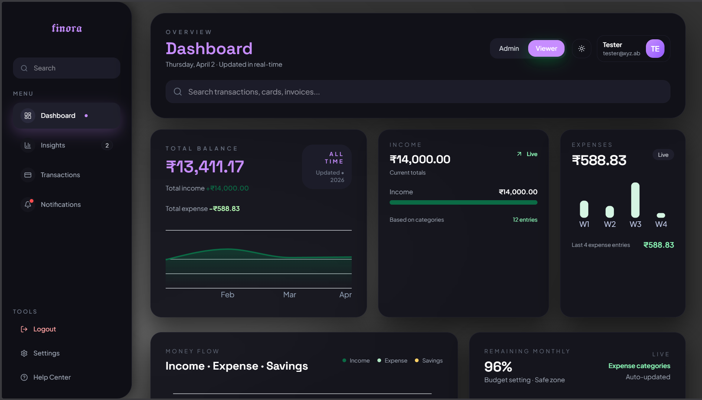
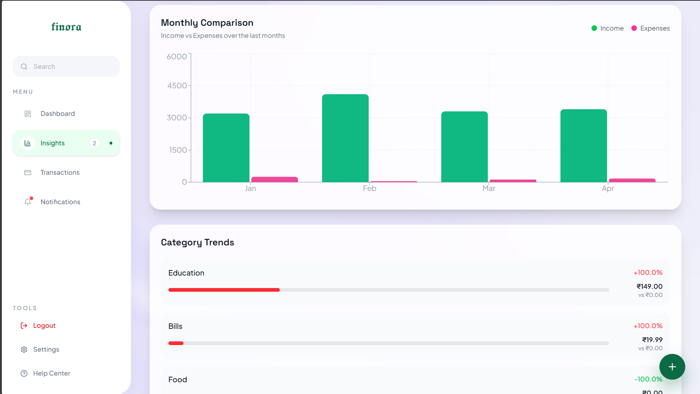
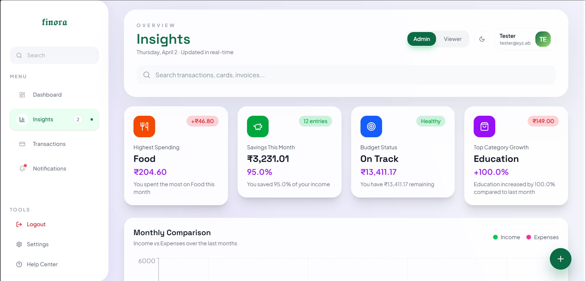

# Finora

Finora is a responsive personal finance dashboard built with React, Vite, TypeScript, and Tailwind CSS.

It provides a polished UI for:
- tracking transactions,
- viewing financial summaries,
- analyzing spending insights,
- switching roles (admin/viewer),
- and authenticating with Supabase.

## Table of Contents

1. Overview
2. Core Features
3. User Roles and Permissions
4. Authentication Flow
5. Transactions Module
6. Dashboard and Insights
7. Navigation and Responsive Behavior
8. Theming and Visual System
9. Images
10. Tech Stack
11. Project Structure
12. State Management
13. Environment Variables
14. Setup and Local Development
15. Build and Deployment
16. Testing
17. Known Limitations
18. Troubleshooting

## Overview

Finora is a single-page finance application with app-like navigation.

Primary pages available from the app shell:
- Dashboard
- Transactions
- Insights
- Notifications (placeholder)
- Help (placeholder)
- Settings (placeholder)

The app uses local persisted state (Zustand + localStorage) for core data and integrates Supabase for authentication.

## Core Features

- Secure authentication with Supabase (sign up, login, logout, session restore)
- Transaction management with create and edit flows
- Transaction filtering, sorting, and global search
- Transaction export (CSV and JSON)
- Financial analytics:
  - total income
  - total expenses
  - current balance
  - monthly overview
  - category breakdown
  - insight messages
- Role-based UX (admin vs viewer)
- Responsive layout for mobile, tablet, and desktop
- Light and dark theme support
- Global top navigation search input across pages and screen sizes, with automatic redirect to Transactions when a query is entered

## User Roles and Permissions

Two roles are supported in app state:

- `admin`
  - can add transactions
  - can edit transactions
  - can export transactions from Transactions page controls
- `viewer`
  - read-only access to transaction data and insights

Role can be switched from navigation controls and is persisted in local storage.

## Authentication Flow

Authentication is implemented with Supabase Auth.

Supported actions:
- Sign up with name, email, password, and optional profile image URL
- Sign in with email and password
- Sign out
- Restore session on app startup
- React to auth state changes in real time

Behavior details:
- If Supabase env vars are missing, the app logs a warning and uses placeholder client values.
- Session bootstrap runs before main app content mounts.
- User profile is mapped into app state with computed initials.

## Transactions Module

Transactions include the following data fields:

- `id` (string)
- `date` (ISO timestamp)
- `description`
- `category`
- `type` (`income` or `expense`)
- `amount` (number)
- `status` (`completed`, `pending`, `failed`)

Implemented capabilities:

- List transactions in table/card layouts depending on screen size
- Add new transaction (admin)
- Edit existing transaction (admin)
- Filter by:
  - category
  - type
- Sort by:
  - date descending/ascending
  - amount descending/ascending
- Reset filters from Transactions header action in top navigation

Validation rules in form flows:
- description is required
- category is required
- amount is required and must be greater than 0

## Export Behavior

Export support exists for:
- CSV export
- JSON export

CSV and JSON export options are available in the Transactions page action menu.

## Dashboard and Insights

Dashboard and Insights consume the same transaction state and compute financial views using shared utility functions.

Examples of derived analytics:
- income / expenses / balance summary
- monthly grouped trends
- highest spending category
- month-over-month expense comparison
- personalized insight text generated from available data

## Navigation and Responsive Behavior

Layout behavior by viewport:

- Desktop (`xl+`): left sidebar + full top navigation + content area
- Tablet (`md` to `xl`): compact sidebar + top navigation + content
- Mobile (`<md`): compact top navigation + bottom navigation + content

Navigation mode:
- Single-page state-driven navigation (not route-based pages)

Global controls:
- Search input in top navigation on all pages and all screen sizes; typing a query redirects to Transactions and filters matching transactions
- Transactions-only actions (reset filters/export) shown only when Transactions page is active

## Theming and Visual System

Theme support:
- Light mode
- Dark mode

Theme is managed through:
- `next-themes` provider
- Zustand theme state persistence
- synchronized theme updates from app controls

Design style:
- glassmorphism-inspired cards and surfaces
- animated background effects
- custom color palette optimized for both light and dark contexts

## Images

The app now includes a set of screenshots and preview images for the UI:

### Dashboard Light Preview



### Dashboard Dark Preview



### Dark Desktop Preview


### Light Desktop Preview


### Insights Overview



### Insights Detail View



### Mobile View Preview


These images are useful for showing the app’s layout, theme differences, and responsive behavior in the README.

## Tech Stack

- React 18
- TypeScript
- Vite
- Tailwind CSS
- Zustand
- Supabase JS client
- Radix UI primitives
- Lucide icons
- Motion (`motion/react`)
- Recharts

## Project Structure

High-level structure:

- `src/app`
  - app shell and screens
  - shared components and UI primitives
  - business logic in `lib`
  - global store in `store`
- `src/styles`
  - global styles, fonts, theme layers
- `public/images`
  - logo and static image assets
- `guidelines`
  - internal docs and validation notes

## State Management

Store: Zustand with persistence middleware.

Persisted keys include:
- user
- authStatus
- theme
- role
- transactions

Key actions include:
- auth lifecycle (`initializeAuth`, `login`, `signup`, `logout`, `syncAuthUser`)
- role updates (`setRole`)
- theme updates (`setTheme`)
- transaction CRUD (`addTransaction`, `updateTransaction`, `deleteTransaction`, `replaceTransactions`)

## Environment Variables

Create a `.env` file in the project root with:

```env
VITE_SUPABASE_URL=your_supabase_project_url
VITE_SUPABASE_ANON_KEY=your_supabase_anon_key
```

Without these values, authentication calls will not work against a real backend.

## Setup and Local Development

Prerequisites:
- Node.js 18+
- npm

Install dependencies:

```bash
npm install
```

Start development server:

```bash
npm run dev
```

Open the local URL shown by Vite (typically `http://localhost:5173`).

## Build and Deployment

Create production build:

```bash
npm run build
```

Output is generated in the `dist` folder.

Recommended deployment targets:
- Vercel
- Netlify
- Static hosting providers that support SPA fallback

Before production deployment, verify:
- Supabase environment variables are configured
- authentication works in production environment
- key workflows (transactions, export, role switch, theme switch) are tested

## Testing

Configured test tooling:
- Vitest
- jsdom
- Testing Library setup in `src/test/setup.ts`

Run tests:

```bash
npm run test
```

Current repository status:
- test runner is configured
- no active `*.test.ts` files are currently present in this workspace snapshot

## Known Limitations

- Notifications page is a placeholder
- Help page is a placeholder
- Settings page is a placeholder
- Transactions are persisted in local app state; there is no full transaction CRUD sync to Supabase tables yet

## Troubleshooting

### `npm run dev` fails

Try:
1. `npm install`
2. remove `node_modules` and lockfile, then reinstall
3. verify Node version (`node -v`)
4. check port conflicts (5173)

### Supabase auth errors

Check:
1. `VITE_SUPABASE_URL` and `VITE_SUPABASE_ANON_KEY` are set
2. Supabase project is active
3. email confirmation settings match your sign-up expectations

### Build warns about large chunks

The build currently succeeds, but Vite may warn about large bundles. This can be improved later with code splitting and manual chunk configuration.
  
